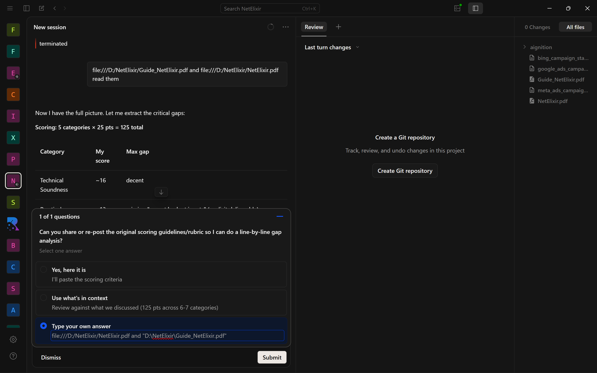

# ZeroHarm AI — Industrial Safety Intelligence Platform

[](https://github.com/shivv23/zeroharm-ai/actions/workflows/test.yml)
[](LICENSE)

**ZeroHarm AI** is a multi-agent industrial safety intelligence platform that detects compound risks before they become catastrophes. Built for the **ET AI Hackathon 2026** — Problem Statement 1: AI-Powered Industrial Safety Intelligence for Zero-Harm Operations.

---

## The Problem

On January 20, 2025, the Visakhapatnam Steel Plant suffered a catastrophic explosion. Eight workers died. Twelve were injured. The root cause? Gas pressure sensors showed warning signals — but no intelligence layer connected those readings to operational decisions. A permit-to-work was issued without checking real-time sensor data. Maintenance proceeded despite abnormal gas accumulation.

**Sensor data without an intelligence layer is just noise.**

## The Solution

ZeroHarm AI bridges the gap between raw sensor data and safety-critical decisions through a parallel multi-agent architecture:

- **3 parallel agents** (Sensor Monitor, Permit Activity, Maintenance Status) continuously analyze plant conditions
- A **Fusion Supervisor** weights and correlates their findings to detect compound risks — conditions where multiple minor issues combine into a critical threat
- **RAG-based compliance checking** cross-references permits against OISD, Factory Act 1948, DGMS, and ISO 45001 standards
- **Real-time WebSocket push** delivers risk scores, alerts, and health metrics every 2 seconds

---

## Screenshots


*Main dashboard with geospatial heatmap, alert panel, and live risk feed.*

---

## Features

| Feature | Description |
|---------|-------------|
| **Geospatial Risk Heatmap** | SVG plant layout with zone-level risk color coding |
| **Multi-Agent Risk Detection** | 3 parallel agents fused by a supervisor for compound risk scoring |
| **Permit-to-Work Intelligence** | Regulatory compliance against OISD, Factory Act, DGMS, ISO 45001 |
| **Emergency Response Orchestration** | Multi-channel dispatch, evacuation, rescue coordination, incident reports |
| **What-If Simulator** | 5 pre-built scenarios + custom scenario builder |
| **Compliance Audit** | 32 checks across 5 categories with weighted scoring |
| **Predictive Risk Trends** | Time-series chart with risk score history |
| **Plant Health Index** | Composite KPI (sensor + permit + risk + compliance) |
| **Agent Activity Feed** | Real-time scrolling multi-agent trace |
| **Incident Pattern Intelligence** | Historical incident analysis with pattern discovery |
| **Database Persistence** | SQLite via SQLAlchemy — state survives restarts |
| **Real Alert Dispatch** | Slack webhook, SMTP email, Twilio SMS dispatch per severity |
| **Semantic Search RAG** | sentence-transformers embeddings over regulatory documents |
| **PDF Reports** | Compliance, incident, and risk assessment PDFs via ReportLab |
| **YOLOv8 Computer Vision** | PPE detection, zone violation alerts, RTSP stream processing |
| **RBAC + Multi-Tenant Auth** | JWT tokens, bcrypt passwords, 4 roles with permission matrix |
| **Incident Investigation + CAPA** | 5-Why analysis, fishbone diagrams, CAPA workflow (open→closed) |
| **Mobile PWA** | Offline-capable, push notifications, touch-optimized field worker dashboard |

> **Note:** All sensor data, alerts, and compliance outputs are generated from synthetic simulation data. Marked with `data_source: simulated` in every API response.

---

## What Makes This Different

1. **Compound risk detection over single-threshold alerts** — Most safety systems fire alerts when a single sensor crosses a threshold. ZeroHarm correlates *multiple conditions simultaneously* (e.g., confined space permit + O₂ depletion + LEL rise = IMMEDIATE SUSPENSION, not three separate warnings).

2. **Multi-agent fusion architecture** — Three specialized agents run in parallel via `asyncio.gather`, each analyzing a different dimension (sensors, permits, maintenance). The supervisor weights their outputs and only escalates when the combined risk exceeds thresholds.

3. **Regulatory-grounded compliance** — Every compliance check maps to specific regulatory standards (OISD-STD-116, Factory Act Sec 36/37, ISO 45001), not generic best-practice lists.

4. **Interactive what-if simulation** — Judges and reviewers can inject safety scenarios (including a replay of the Vizag 2025 conditions) and watch the agent system respond in real-time.

---

## Architecture

```
Frontend (React 18) ←── WebSocket + REST ──→ API Gateway (FastAPI)
                                                  │
                                        Orchestration Layer
                                        ├── Compound Risk Detection Engine
                                        │   ├── Sensor Monitor Agent
                                        │   ├── Permit Activity Agent
                                        │   ├── Maintenance Status Agent
                                        │   └── Fusion Supervisor
                                        ├── RAG Pipeline (regulatory compliance)
                                        ├── Emergency Response Orchestrator
                                        ├── Incident Pattern Intelligence
                                        ├── What-If Simulator
                                        └── Quality & Compliance Audit Agent
                                                  │
                                         Synthetic Data Generator
                                          (80 sensors, 10 zones)
```

---

## Tech Stack

| Layer | Technology |
|-------|-----------|
| Frontend | React 18, PWA (service worker + manifest) |
| Backend | FastAPI + Uvicorn |
| Communication | WebSocket (real-time) + REST |
| Knowledge Graph | NetworkX |
| RAG | semantic-search (sentence-transformers) + keyword fallback |
| Data Generation | NumPy |
| Containerization | Docker, docker-compose |
| Database | SQLite + SQLAlchemy (async) |
| Auth | JWT + bcrypt |
| Vision | YOLOv8 (Ultralytics) |
| PDF | ReportLab |

---

## Quick Start

### Option 1: Docker (recommended)

```bash
docker compose up -d
# Backend: http://localhost:8000
# Frontend: http://localhost:8080
# API docs: http://localhost:8000/docs
```

### Option 2: Manual

```bash
# Backend
cd backend
pip install -r requirements.txt
python -m uvicorn api.main:app --host 0.0.0.0 --port 8000

# Frontend (separate terminal)
cd frontend
npm install
npm start
```

---

## API Documentation

Interactive Swagger docs available at `http://localhost:8000/docs` when the backend is running.

### Key Endpoints

| Endpoint | Method | Description |
|----------|--------|-------------|
| `/api/health` | GET | Health check |
| `/api/auth/login` | POST | JWT login |
| `/api/auth/register` | POST | Register user |
| `/api/auth/me` | GET | Current user info |
| `/api/plant/state` | GET | Current plant sensor and permit state |
| `/api/risk/current` | GET | Current risk analysis |
| `/api/risk/alerts` | GET | Active alerts |
| `/api/risk-trend` | GET | Risk score time-series |
| `/api/sensors` | GET | All sensor readings |
| `/api/permits` | GET | Active permits |
| `/api/compliance/audit` | GET | Quality & compliance audit |
| `/api/compliance/trend` | GET | Compliance history + recommendations |
| `/api/health-index` | GET | Composite plant health score |
| `/api/kg/query` | GET | Knowledge graph query |
| `/api/regulatory/{hazard}` | GET | Regulatory context for hazard type |
| `/api/what-if/scenarios` | GET | List available scenarios |
| `/api/what-if/apply` | POST | Apply a built-in scenario |
| `/api/what-if/custom` | POST | Apply a custom scenario |
| `/api/what-if/reset` | POST | Reset to normal operations |
| `/api/emergency/trigger` | POST | Trigger emergency response |
| `/api/emergency/active` | GET | Active emergencies |
| `/api/rag/permit-compliance` | POST | RAG-based permit compliance check |
| `/api/rag/search` | POST | Semantic search over regulatory docs |
| `/api/incident-patterns` | GET | Incident patterns and statistics |
| `/api/investigation/list` | GET | List investigations |
| `/api/investigation/create` | POST | Create investigation |
| `/api/investigation/{id}/finding` | POST | Add finding to investigation |
| `/api/investigation/{id}/capa` | POST | Create CAPA item |
| `/api/investigation/capa/{id}/status` | PUT | Update CAPA status |
| `/api/reports/compliance` | GET | PDF compliance report |
| `/api/reports/incident/{id}` | GET | PDF incident report |
| `/api/reports/risk` | GET | PDF risk assessment |
| `/api/vision/detect` | POST | YOLOv8 object detection on image |
| `/api/vision/rtsp/start` | POST | Start RTSP stream processing |
| `/api/vision/rtsp/stop` | POST | Stop RTSP stream |
| `/api/vision/status` | GET | Vision system status |
| `/api/activity-feed` | GET | Multi-agent activity log |
| `/ws` | WebSocket | Real-time state updates (2s interval) |

---

## Testing

```bash
# Run all agent tests
make test
# or
python scripts/test_agents.py
```

All 8 agent component tests pass: synthetic data generator, knowledge graph, compound risk engine, RAG pipeline, emergency orchestrator, incident pattern intelligence, simulation cycle, and compound event scenario.

---

## Project Structure

```
zeroharm-ai/
├── backend/
│   ├── api/main.py              # FastAPI server + WebSocket
│   ├── agents/                  # Multi-agent system
│   │   ├── compound_risk_engine.py
│   │   ├── sensor_monitor_agent.py
│   │   ├── permit_activity_agent.py
│   │   ├── maintenance_status_agent.py
│   │   ├── quality_compliance_agent.py
│   │   └── agent_activity_feed.py
│   ├── orchestrator/            # Coordination layer
│   │   ├── emergency_response.py
│   │   ├── incident_investigation.py
│   │   ├── incident_pattern_intelligence.py
│   │   └── what_if_simulator.py
│   ├── rag/
│   │   ├── rag_pipeline.py      # Regulatory document RAG
│   │   └── semantic_search.py   # sentence-transformers embeddings
│   ├── knowledge_graph/         # NetworkX knowledge graph
│   ├── auth/auth_manager.py     # JWT + bcrypt RBAC
│   ├── vision/integration.py    # YOLOv8 computer vision
│   ├── config/                  # 16 JSON config files
│   ├── database.py              # SQLAlchemy async persistence
│   ├── alert_dispatcher.py      # Slack/email/SMS dispatch
│   ├── report_generator.py      # PDF reports via ReportLab
│   ├── data/                    # Synthetic data engine
│   ├── constants.py             # Env-based configuration
│   └── config_loader.py         # JSON config loader
├── frontend/
│   ├── public/
│   │   ├── service-worker.js    # PWA: offline cache + push
│   │   ├── manifest.json        # PWA manifest
│   │   └── offline.html         # Offline fallback
│   └── src/
│       ├── App.js               # Main dashboard
│       ├── components/          # All UI components (15 files)
│       │   ├── MobileDashboard.js     # Mobile PWA dashboard
│       │   ├── IncidentInvestigation.js # CAPA workflow UI
│       │   └── PushNotificationManager.js
│       └── store/               # WebSocket + theme + routes
│           ├── theme.js         # Design system (all visual constants)
│           └── apiRoutes.js     # Centralized API paths
├── scripts/                     # Test and utility scripts
├── docs/                        # Architecture documentation + screenshots
├── docker-compose.yml
├── Makefile
└── .env.example
```

---

## Known Gaps

This is a hackathon prototype with simulated data. Key gaps vs. a production system:

| Gap | Priority | Notes |
|-----|----------|-------|
| Real sensor integration | 🔴 High | Currently uses synthetic data (80 sensors, realistic noise models) |
| Production database | 🟡 Medium | SQLite sufficient for demo; would need PostgreSQL for production |
| 3D digital twin | 🟢 Low | 2D SVG heatmap with geospatial overlay |
| Full test coverage | 🟡 Medium | 8 integration tests cover core agent pipeline |

---

## License

MIT
